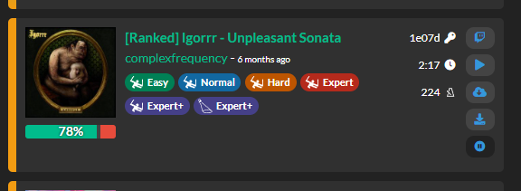

# BeatsaverUserscript
Some modifications for https://beatsaver.com

## Features
### Add preview 10 sec button

## Install
Just open [this url](https://github.com/mixa3607/BeatsaverUserscript/raw/master/release/main.user.js)

## Development
For local build you must apply patch from [this pull request](https://github.com/Trim21/axios-userscript-adapter/pull/58).

In npm `build:watch` mode you can just add `./dist/main.meta.js` to userscripts and reload page for apply changes without any additional actions. 
